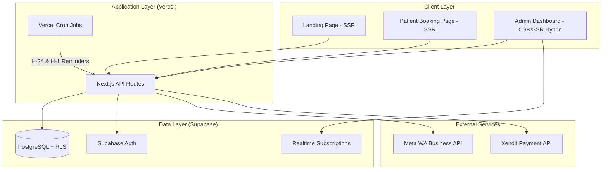
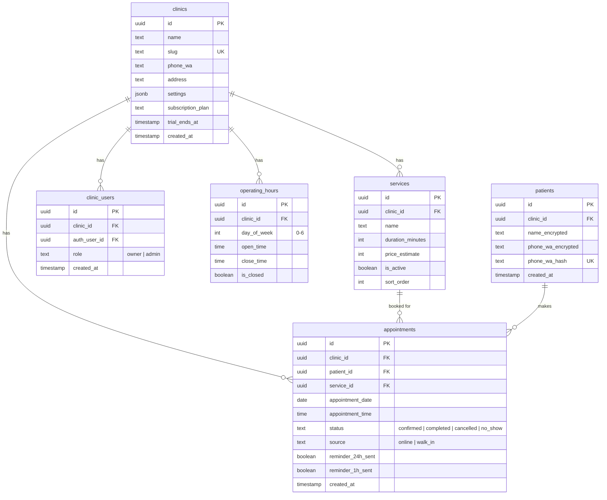

# Architecture Decision Document: SenYumBook

## 1. Project Context

### 1.1 System Overview
SenYumBook is a reservation-first SaaS for small dental clinics in Indonesia. It provides a frictionless public booking link, automated WhatsApp reminders, and a mobile-first admin dashboard. The system is designed as a multi-tenant web application where each clinic operates as an isolated tenant.

### 1.2 Project Classification
- **Project Type:** Full-Stack Web Application (Next.js)
- **Domain:** Healthcare Scheduling (Medium Complexity)
- **Scale Target:** 100 clinics in 90 days, scaling to 500+ within 6 months
- **Deployment Region:** Southeast Asia (Indonesia primary)

### 1.3 Key Architecture Drivers
1. **Mobile-First Performance:** Sub-2-second page loads on Indonesian 4G networks.
2. **WhatsApp Reliability:** >95% message delivery rate for reminders.
3. **Data Privacy (UU PDP):** PII encryption at rest (AES-256) and in transit (TLS 1.2+).
4. **Operational Simplicity:** Solo-developer maintainable with minimal DevOps overhead.
5. **Cost Efficiency:** Start below Rp 500,000/month infrastructure cost.

---

## 2. Technology Stack Decisions

### 2.1 Frontend Framework
- **Decision:** Next.js 14+ (App Router)
- **Rationale:** Server-side rendering for SEO (landing page), excellent mobile performance, API routes eliminate the need for a separate backend service.
- **UI Layer:** Shadcn/UI + Tailwind CSS (Pure Zen theme as defined in UX Spec).

### 2.2 Backend & Database
- **Decision:** Supabase (PostgreSQL + Auth + Realtime + Storage + Edge Functions)
- **Rationale:** Provides auth, database, real-time subscriptions, and edge functions in a single managed service. Row-Level Security (RLS) handles multi-tenancy natively. Built-in AES-256 encryption at rest satisfies DR-01.

### 2.3 WhatsApp Integration
- **Decision:** Meta Official WhatsApp Business Cloud API
- **Rationale:** Official API ensures message delivery reliability (NFR-04: >95%). Template-based messages for reminders comply with Meta policies. No third-party middleman cost.

### 2.4 Payment Gateway
- **Decision:** Xendit
- **Rationale:** Supports VA, e-wallet (GoPay, OVO, Dana), and QRIS — the dominant payment methods in Indonesia. Recurring billing API for subscription management.

### 2.5 Hosting & Deployment
- **Decision:** Vercel (Frontend + API Routes) + Supabase Cloud (Database)
- **Rationale:** Vercel provides global CDN with Singapore edge (closest to Indonesia), automatic HTTPS (DR-02), and zero-config deployments from Git. Supabase Cloud handles database hosting, backups (DR-05), and edge functions.

---

## 3. System Architecture

### 3.1 High-Level Architecture



### 3.2 Multi-Tenancy Strategy
- **Approach:** Shared Database, Row-Level Security (RLS)
- **Implementation:** Every table includes a `clinic_id` column. Supabase RLS policies enforce that authenticated users can only access rows matching their `clinic_id` from the JWT claims.
- **Rationale:** Simplest approach for <500 tenants. No schema-per-tenant complexity. PostgreSQL RLS provides database-level isolation.

### 3.3 Authentication Strategy
- **Patient (Public):** No authentication required. Booking is fully anonymous (Name + WA number only).
- **Clinic Users:** Supabase Auth with Google OAuth and Magic Link (email). JWT tokens contain `clinic_id` and `role` (owner/admin) claims.
- **Session Management:** Short-lived access tokens (1 hour) with refresh tokens. Satisfies DR-03.

---

## 4. Database Schema

### 4.1 Core Tables



### 4.2 PII Encryption Strategy (DR-01)
- **Encrypted Fields:** `patients.name_encrypted`, `patients.phone_wa_encrypted` using `pgcrypto` extension with AES-256.
- **Hash Field:** `patients.phone_wa_hash` (SHA-256) for deduplication lookups without decryption.
- **Encryption Key:** Stored as Supabase Vault secret, never exposed to client.

### 4.3 Indexing Strategy
- `appointments(clinic_id, appointment_date)` — Primary query for daily schedule view (Admin).
- `appointments(clinic_id, appointment_date, reminder_24h_sent)` — Cron job query for pending reminders.
- `patients(clinic_id, phone_wa_hash)` — Deduplication on booking.
- `clinics(slug)` — Public booking page URL resolution.

---

## 5. API Architecture

### 5.1 API Design
- **Style:** RESTful API Routes in Next.js App Router (`/api/v1/...`)
- **Auth:** Supabase JWT verification middleware on all protected routes.
- **Error Handling:** Standardized JSON error responses with error codes.

### 5.2 Core API Endpoints

| Method | Endpoint | Auth | Description |
|:-------|:---------|:-----|:------------|
| GET | `/api/v1/public/clinics/:slug` | None | Get clinic public info + services |
| GET | `/api/v1/public/clinics/:slug/slots` | None | Get available time slots for a date |
| POST | `/api/v1/public/clinics/:slug/book` | None | Create new appointment |
| GET | `/api/v1/appointments` | JWT | List clinic appointments (with filters) |
| POST | `/api/v1/appointments` | JWT | Create manual (walk-in) appointment |
| PATCH | `/api/v1/appointments/:id` | JWT | Update appointment status |
| DELETE | `/api/v1/appointments/:id` | JWT | Cancel appointment |
| GET | `/api/v1/clinic/settings` | JWT | Get clinic settings |
| PUT | `/api/v1/clinic/settings` | JWT | Update clinic settings |
| POST | `/api/v1/webhooks/whatsapp` | WA Verify | Receive WA message webhooks |
| POST | `/api/v1/webhooks/xendit` | Xendit Verify | Receive payment webhooks |

### 5.3 Slot Locking Strategy (FR-05)
- **Approach:** Optimistic locking with database constraint.
- **Implementation:** Unique constraint on `(clinic_id, service_id, appointment_date, appointment_time)`. If two patients attempt to book the same slot simultaneously, the second INSERT fails and the UI displays "Slot sudah terisi".
- **No Redis needed** at this scale.

---

## 6. WhatsApp Reminder Engine

### 6.1 Architecture
- **Trigger:** Vercel Cron Jobs running every 15 minutes.
- **Logic:** Query `appointments` where `appointment_date` is tomorrow and `reminder_24h_sent = false`, or appointment is within 1 hour and `reminder_1h_sent = false`.
- **Execution:** For each match, call Meta WA Cloud API `POST /messages` with pre-approved template.
- **Delivery Tracking:** On successful API response, set `reminder_*_sent = true`.

### 6.2 Message Templates
Pre-registered with Meta:
1. **Booking Confirmation:** "Halo {name}! Jadwal Anda di {clinic} pada {date} pukul {time} telah dikonfirmasi. ✅"
2. **Reminder H-24:** "Halo {name}! Mengingatkan bahwa besok Anda memiliki jadwal di {clinic} pukul {time}. Sampai jumpa! 😊"
3. **Reminder H-1:** "Halo {name}! 1 jam lagi jadwal Anda di {clinic}. Kami menunggu kedatangan Anda! 🦷"

---

## 7. Deployment & Infrastructure

### 7.1 Environment Strategy
| Environment | Purpose | URL |
|:------------|:--------|:----|
| Development | Local dev | `localhost:3000` |
| Preview | PR previews | `*.vercel.app` (auto) |
| Production | Live | `senyumbook.com` |

### 7.2 CI/CD Pipeline
- **Source:** GitHub (main branch)
- **Build:** Vercel auto-deploy on push to `main`
- **Preview:** Vercel auto-deploy on PR creation
- **Database Migrations:** Supabase CLI migrations committed to repo, applied manually before deploy.

### 7.3 Monitoring & Observability
- **Performance:** Vercel Analytics (Web Vitals, NFR-01)
- **Uptime:** BetterStack or UptimeRobot (NFR-02)
- **Error Tracking:** Sentry (free tier)
- **Database:** Supabase built-in dashboard

### 7.4 Backup Strategy (DR-05)
- Supabase provides automated daily backups with 30-day retention (Pro plan).
- Additional point-in-time recovery available on Pro plan.

---

## 8. Security Considerations

### 8.1 Security Measures
| Threat | Mitigation |
|:-------|:-----------|
| SQL Injection | Supabase client uses parameterized queries |
| XSS | React auto-escapes; CSP headers on Vercel |
| CSRF | SameSite cookies + Supabase Auth tokens |
| Data Breach (PII) | AES-256 encryption at rest (pgcrypto), TLS 1.2+ in transit |
| Unauthorized Access | RLS policies + JWT verification middleware |
| Rate Limiting | Vercel edge rate limiting on public booking endpoints |

### 8.2 UU PDP Compliance (DR-04)
- **Right to be Forgotten:** API endpoint to soft-delete patient data (set `deleted_at`), then a scheduled job hard-deletes after 30-day grace period.
- **Data Minimization:** Only collect Name and WA number from patients. No additional PII.

---

## 9. Cost Estimation (Monthly)

| Service | Tier | Est. Cost |
|:--------|:-----|:----------|
| Vercel | Pro | ~$20 (Rp 310K) |
| Supabase | Pro | ~$25 (Rp 390K) |
| Meta WA API | Pay-per-message | ~$10-30 (Rp 155K-465K) for 100 clinics |
| Xendit | Transaction fee | 0.7% per transaction (passed to user) |
| Domain | Annual | ~$12/year |
| **Total** | | **~Rp 500K-1.2M/month** |

---

## 10. Project Structure

```
senyumbook/
├── src/
│   ├── app/
│   │   ├── (landing)/          # Landing page (SSR)
│   │   ├── (public)/           # Patient booking pages
│   │   │   └── [slug]/         # Dynamic clinic booking
│   │   ├── (dashboard)/        # Authenticated admin area
│   │   │   ├── schedule/       # Daily/weekly calendar
│   │   │   ├── patients/       # Patient list
│   │   │   ├── settings/       # Clinic settings
│   │   │   └── billing/        # Subscription management
│   │   └── api/
│   │       └── v1/
│   │           ├── public/     # Unauthenticated endpoints
│   │           ├── appointments/
│   │           ├── clinic/
│   │           └── webhooks/   # WA + Xendit webhooks
│   ├── components/
│   │   ├── ui/                 # Shadcn/UI components
│   │   ├── booking/            # Patient booking components
│   │   ├── dashboard/          # Admin dashboard components
│   │   └── landing/            # Landing page sections
│   ├── lib/
│   │   ├── supabase/           # Supabase client + helpers
│   │   ├── whatsapp/           # WA API integration
│   │   ├── xendit/             # Xendit integration
│   │   └── utils/              # Shared utilities
│   └── styles/
│       └── globals.css         # Tailwind + Pure Zen theme
├── supabase/
│   ├── migrations/             # Database migrations
│   └── seed.sql                # Seed data
├── public/                     # Static assets
└── package.json
```

---

*Architecture Document Complete — Ready for Epic/Story decomposition.*
